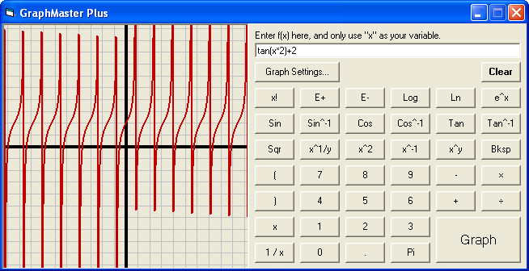



## GraphMaster Plus

### Description

This code is based off of my other code - Calculadora Plus (http://planet-source-code.com/vb/scripts/ShowCode.asp?txtCodeId=62676&amp;lngWId=1). It can graph a function of x, and the buttons are in the same exact style as Calculadora Plus, except some of them had to be removed because of the purpose of this code. Enjoy the power of this graphing tool!
 
### More Info
 

             |
---                |---
**Submitted On**   |2006-03-11 13:26:40
**By**             |[mathXpert](https://github.com/Planet-Source-Code/PSCIndex/blob/master/ByAuthor/mathxpert.md)
**Level**          |Intermediate
**User Rating**    |5.0 (10 globes from 2 users)
**Compatibility**  |VB 6\.0
**Category**       |[Math/ Dates](https://github.com/Planet-Source-Code/PSCIndex/blob/master/ByCategory/math-dates__1-37.md)
**World**          |[Visual Basic](https://github.com/Planet-Source-Code/PSCIndex/blob/master/ByWorld/visual-basic.md)
**Archive File**   |[GraphMaste1979403112006\.zip](https://github.com/Planet-Source-Code/mathxpert-graphmaster-plus__1-64247/archive/master.zip)

